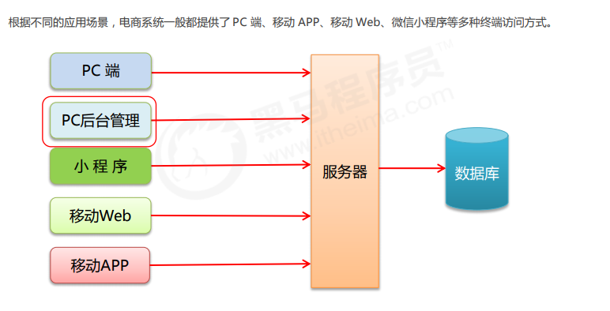
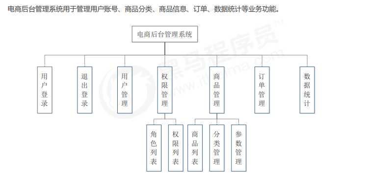
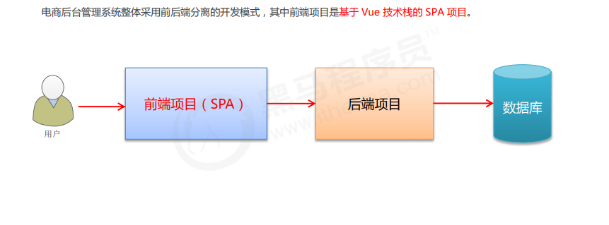

## 1. 项目概述
### 1.1 电商项目基本业务概述

### 1.2 电商后台管理系统的功能

### 1.3 电商后台管理系统的开发模式（前后端分离）

### 1.4 电商后台管理系统的技术选型
 1. 前端项目技术栈
     * Vue
     * Vue-router
     * Element-UI
     * Axios
     * Echarts
 2. 后端项目技术栈
      * Node.js
      * Express
      * Jwt
      * Mysql
      * Sequelize
## 2. 项目初始化
### 2.1 前端项目初始化步骤
 * ① 安装 Vue 脚手架
 * ② 通过 Vue 脚手架创建项目
 * ③ 配置 Vue 路由
 * ④ 配置 Element-UI 组件库 (插件)
 * ⑤ 配置 axios 库  (依赖)
 * ⑥ 初始化 git 远程仓库
 * ⑦ 将本地项目托管到 Github 或 码云 中