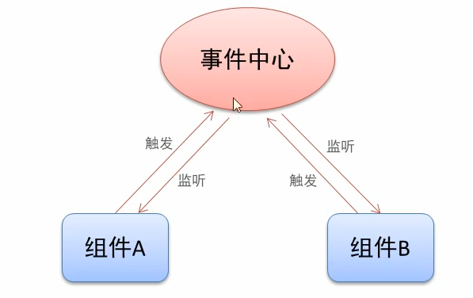

### 2.注册组件
#### 2.2 全局组件注册语法
```	
Vue.component(组件名称,{
	data:组件数据,
	template:组件模板内容
})
 关于组件名:<my-component-name> 和 <MyComponentName> 都是可接受的,推荐第一种
```

 使用例子
```
<!DOCTYPE html>
<html>
	<head>
		<meta charset="utf-8">
		<title>组件开发</title>
		<script src="js/vue.js"></script>
	</head>
	<body>
		<div id="app">
			<counter>123</counter>
			<counter>忽略这里的值</counter>
			<counter>每隔组件有自己独立的数据</counter>
			<hr>
			<helloworld></helloworld>
		</div>
		<script>
			
			// Vue.component('counter',{
			// 	data:function(){
			// 		return {
			// 			count:0,
						
			// 		}
			// 	},
			// 	template:'<button @click="handle">点击了{{count}}次</button>',
			// 	methods:{
			// 		handle:function(){
			// 			this.count += 2;
			// 		}
			// 	}
			// })
			// -----------------------------
			// 模板字符串方式 单引号改 `` 注释号
			Vue.component('counter',{
				data:function(){
					return {
						count:0,
					}
				},
				template:`
				<div>
				<button @click="handle">点击了{{count}}次</button>
				<helloworld></helloworld>
				<hr>
				</div>
				`,
				methods:{
					handle:function(){
						this.count += 2;
					}
				}
			})
			//注册helloworld组件
			Vue.component('helloworld',{
				data:function(){
					return {
						msg:'HelloWorld'
					}
				},
				template:'<div>{{msg}}</div>'
			})
			var vm = new Vue({
				el : "#app",
				data:{}
			})
		</script>
	</body>
</html>

```

#### 2.3组件注册注意事项
   1. data必须是个函数
   2. 组件模板内容只能有一个根元素
      - ```<p>1</p><p>2</p>   //报错，存在多个根元素                     ```
	  - ```<div><p>1</p><p>2</p></div>  //包起来就是一个根元素 ```
   3. 组件模板内容可以是模板字符串
      - 模板字符串需要浏览器提供支持(ES6语法)
	  - 用法只需要把引号,改成用``注释号包裹就行
   4. 组件命名方式
      - 短横线方式 ' my-component' 兼容性最好
	  - 驼峰式     'Mycomponent'
	  - 新版测试,其实命名全部小写也通用了,
#### 2.4局部组件注册
语法:
```new Vue({
	  el:'#app'
	  components: {
		  'component-a': {/*  */},
		  'component-b': componentB,     //属性值,一般都是个对象
		  'component-c': componentC,
	  }
  })
  //把属性值定义在Vue实例外面代码更直观好看
  var componentC = {
	  data: {
		  return: {
			  msg:'Hello world'
		  }
	  },
	  template: '<div>{{msg}}</div>'
  }
```
局部组件只能在注册它的父组件中使用,例如:全局组件中想嵌套一个局部组件是会报错的

### 3. 组件调试工具vue-devtools
  
### 4.组件间数据交互
#### 4.1父组件向子组件传值
   1. 组件内部通过props接收传递过来的值
``` 
Vue.component('menu-item',{
   props: ['title'],    //一个数组对象，可以绑定多个属性
   template:'<div>{{title}}</div>'
})
```
   2. 父组件通过属性将值传递给子组件
	* `<menu-item title="来自父组件的值"></menu-item>`
	* `<menu-item :title="ptitle"></menu-item>`
   3. props属性名规则
   * 在porps中使用驼峰式，html模板中需要用短横线的形式
   * 字符串的模板中没有这个限制
``` 
Vue.component('menu-item',{
   props: ['menuTitle'],    //在JavaScript中是驼峰式
   template:'<div>{{title}}</div>'
})
<!-- 在html中是短横线的形式 -->
<menu-item menu-title="nihao"></menu-item>
//为什么这样？，可能是JavaScript中区分大小写，而html中不区分大小写
```

#### 4.2 子组件向父组件传值
   1. 子组件通过自定义事件向父组件传递信息
    `<button v-on:click='$emit("enlarge-text")'>扩大字体</button>`
   2. 父组件监听子组件的事件
    `<menu-item v-on:enlarge-text='fontSize += 0.1'></menu-item>`
   3. 子组件通过自定义事件向父组件传递带参数信息
    `<button v-on:click='$emit("enlarge-text",0.1)'>扩大字体</button>`
   2. 父组件监听子组件的事件
    `<menu-item v-on:enlarge-text='fontSize += $event'></menu-item>`
组件间数据交互案例
```
<!DOCTYPE html>
<html>
	<head>
		<meta charset="utf-8">
		<title></title>
		<script src="js/vue.js"></script>
	</head>
	<body>
		<div id="app">
			<div>{{pmsg}}</div>
			<p>父组件向子组件传值案例</p>
			<menu-item title="来自父组件的值" title2="hello"></menu-item>
			<menu-item :title="ptitle" title2="hi"></menu-item>
			<!-- title绑定字符串值,理解为来自html的值,而html也属于父组件 -->
			<!-- title绑定ptitle是vue实例父组件data中的属性, -->
			<menu-itemb :menu-txt="ptitle"></menu-itemb>
			<br>
			<hr>
			<p>子组件向父组件传值案例</p>
			<zi-fu :parr="fparr" @enlarge-text="handle"></zi-fu>
			<!-- // 为了区分props的parr属性，与对应父组件中fparr值，也是parr属性的值 -->
			<br><br>
			<div :style="{fontSize: fontSize + 'px'}">{{ptitle}}</div>
			<!-- :style可以绑定一个对象 -->
			<div style="font-size: 10px; color: #008000;">{{pmsg}}</div>
			<br>
			<hr>
			<!-- 子组件向父组件传值--携带参数	 -->
			<p>子组件向父组件传值--携带参数的案例</p>
			<div :style="{fontSize: fontSize2 + 'px'}">{{pmsg}}</div>
			<zi-fu2 @enlarge-text="handle2($event)"></zi-fu2>
		</div>
		<script type="text/javascript">
			/*
			  1,父组件向子组件传递值
			*/
		   Vue.component('menu-item',{
			   props: ['title','title2'],
			   data: function(){
				   return {
					   msg: '子组件本身的数据'
				   }
			   },
			   template:'<div>{{msg + "---" + title + "---" + title2}}</div>'
		   })
		   Vue.component('menu-itemb',{
		   			   props: ['menuTxt'],
		   			   template:'<div>{{menuTxt}}</div>'
		   })
		   
		   /*
		     2,子组件向父组件传值--基本用法
			    props传递数据原则: 单向数据流，只适用于父组件向子组件传递值
		   */
		  Vue.component('zi-fu',{
			  props:['parr'],
			  template:`
			  <div>
			    <ul>
				  <li :key='index' v-for='(item,index) in parr'>{{item}}</li>
				</ul>
				<button @click='parr.push("lemon")'>点击</button>
				<!-- // 这里每次点击，都向父组件中的fparr数组添加一个"lemon"值，但vue官方不建议这样做， -->
				<!-- // 原则是单向的数据流，让控制逻辑更简单清晰。 -->
				<button v-on:click='$emit("enlarge-text")'>扩大字体</button> 
				<!-- 通过自定义事件向父组件传递信息 -->
			  </div>
			  `
		  })
			  /*
			    3,子组件向父组件传值--携带参数		 
			  */
		 Vue.component('zi-fu2',{
			  
			  template:`
			  <div>		
				<button v-on:click='$emit("enlarge-text",1)'>扩大字体2.0</button> 
				<button v-on:click='$emit("enlarge-text",5)'>扩大字体2.1</button> 
				<!-- 通过$emit方法触发自定义的事件,然后再html中绑定这个事件,就变成绑定事件型用法一样了 -->
			  </div>
			  `
		  })
			var vm = new Vue({
				el:'#app',
				data: {
					pmsg: '父组件中的内容',
					ptitle: '动态绑定属性值',
					fparr: ['apple','orange','banana'],
					fontSize: 10,
					fontSize2: 5
				},
				methods:{
					handle:function(){
						// 扩大字体
						this.fontSize += 5;
					},
					handle2:function(val){
						this.fontSize2 += val;
					}
					
				}
			})
		</script>
	</body>
</html>

```

#### 4.3 非父子组件间传值
   1. 单独的事件中心管理组件间的通信
    
   语法new一个实例对象: var eventHub = new Vue()
   2. 监听事件与销毁事件
      * 事件监听 eventHub.$on('add-todo',addTodo)  对比：html中一般用 v-on 简写@监听事件
	  * 事件销毁 eventHub.$off('add-todo')
   3. 触发事件
      - eventHub.$emit('add-todo',id)   其中id是携带的参数,也可以是其他参数
   4.理解：监听事件，销毁事件，触发事件都可以创建自定义事件，没有则创建思想。
例子
```
<!DOCTYPE html>
<html>
	<head>
		<meta charset="utf-8">
		<title>非父子组件传值</title>
		<script src="js/vue.js"></script>
	</head>
	<body>
		<div id="app">
			<div>父组件</div>
			<div>
				<button @click="handle">销毁事件</button>
			</div>
			<test-tom></test-tom>
			<test-jerry></test-jerry>
		</div>
		<script>
			/*
			  兄弟组件之间数据传递
			*/
		   //提供事件中心
		   var hub = new Vue();
		   Vue.component('test-tom',{
			   data:function(){
				   return {
				   	 num :0
				   }
			   },
			   template:`
			   <div>
			     <div>Tom:{{num}}</div>
				 <div>
				    <button @click='handle'>点击</button>
				 </div>
			   </div>
			   `,
			  methods:{
				  handle:function(){
					hub.$emit('event-jerry',3);
				  }
			  },
			  // 钩子函数mounted触发表示模板已经就绪了,可以对模板相关操作了
			  mounted:function(){
			  	//监听事件
				hub.$on('event-tom',(val) => {
					this.num += val; 
				});
			  }
		   });
		   Vue.component('test-jerry',{
		   			   data:function(){
		   				   return {
							   num :0
						   }
		   			   },
		   			   template:`
		   			   <div>
		   			     <div>Jerry:{{num}}</div>
		   				 <div>
		   				    <button @click='handle'>点击</button>
		   				 </div>
		   			   </div>
		   			   `,
		   			  methods:{
		   				  handle: function(){
							  //触发兄弟组件的事件
							  hub.$emit('event-tom',1);
						  }
		   			  },
					  mounted:function(){
					  	//监听事件
						hub.$on('event-jerry',(val) => {
							this.num += val; 
						});
					  }
		   });
		   var vm = new Vue({
			   el: '#app',
			   data:{  
			   },
			   methods:{
				   handle:function(){
					   hub.$off('event-tom');
					   hub.$off('event-jerry');
				   }
			   }
		   });
		</script>
	</body>
</html>
```

### 5.组件插槽
#### 5.1组件插槽的作用
  * 父组件向子组件传递内容(指模板的内容)
#### 5.2组件插槽的基本用法
Vue 自定义的 <slot> 元素让这变得非常简单：
```
Vue.component('alert-box', {
  template: `
    <div class="demo-alert-box">
      <strong>Error!</strong>
      <slot>默认内容</slot>
    </div>
  `
})
```
插槽内容
```
<alert-box>这里内容传给模板里的<slot></alert-box>
```
#### 5.3具名插槽用法
1 <slot> 元素有一个特殊的 attribute：name。这个 attribute 可以用来定义额外的插槽：
```
1.插槽定义
<div class="container">
  <header>
    <slot name="header"></slot>
  </header>
  <main>
    <slot></slot>
  </main>
  <footer>
    <slot name="footer"></slot>
  </footer>
</div>
2.插槽内容
<base-layout>
	<h2 slot="header">标题信息1</h2>
	<h2 slot="header">标题信息2</h2>
	<p>主要内容1</p>
	<p>主要内容2</p>
	<p slot="footer">底部信息</p>
</base-layout>
```
插槽使用code
```

```
#### 5.4作用域插槽
父级模板里的所有内容都是在父级作用域中编译的；子模板里的所有内容都是在子作用域中编译的。
但通过slot-scope属性可以获取到子组件中数据
 * 应用场景: 父组件对子组件内容进行加工处理
   - 方法：通过slot-scope属性获取到子组件<slot>中绑定的属性。用slot-scope属性值点(.)方式指定<slot>绑定的某个属性
组件插槽的全部例子
```
<!DOCTYPE html>
<html>
	<head>
		<meta charset="utf-8">
		<title>组件插槽</title>
		<script src="js/vue.js"></script>
		<style>
			.color{
				color:orange;
			}
		</style>
	</head>
	<body>
		<div id="app">
			<alert-box>有bug发生</alert-box>
			<alert-box>有个警告</alert-box>
			<alert-box></alert-box>
			<hr>
			<base-layout>
				<h2 slot="header">标题信息1</h2>
				<h2 slot="header">标题信息2</h2>
				<!-- 与下面用template包裹起来效果一样 -->
				<p>主要内容1</p>
				<p>主要内容2</p>
				<p slot="footer">底部信息</p>
			</base-layout>
			<hr>
			<base-layout>
			  <template v-slot:header>
				  <!-- v-slot 与 slot 效果一样 -->
				  <!-- template是vue的API，用于包裹多个标签 -->
			    <h1>标题信息1</h1>
				<h1>标题信息2</h1>
			  </template>
			  <p>主要内容1</p>
			  <p>主要内容2</p>
			  <template slot:footer>
			    <p>底部信息1</p>
				<p>底部信息2</p>
			  </template>
			</base-layout>
			<hr>
			<h3>插槽作用域演示</h3>
			<fruit-list v-bind:list="list">
				<template slot-scope="abc">
					<!-- slot-scope属性可以获取到子组件<slot>中绑定的属性 -->
					<strong v-if="abc.info.id==2" class="color">{{abc.info.name}}</strong>
					<span v-else>{{abc.info.name}}</span>
				</template>
			</fruit-list>
		</div>
		<script type="text/javascript">
			/*
			组件插槽
			*/
		   Vue.component('alert-box',{
			 template:`
			   <div>
				 <strong>Error:</strong>
				 <slot>默认内容</slot>
			   </div>
			`
		   });
		   /*
		   具名插槽
		   */
		   Vue.component('base-layout',{
			 template:`
			   <div class="container">
			     <header>
			       <slot name="header"></slot>
			     </header>
			     <main>
			       <slot></slot>
			     </main>
			     <footer>
			       <slot name="footer"></slot>
			     </footer>
			   </div>
			`
			});
			
			/*
			作用域插槽
			*/
		   Vue.component('fruit-list',{
			   props:['list'],
			 template:`
			   <div class="container">
			     <li :key='item.id' v-for='item in list'>
				 <slot :info='item'>{{item.name}}</slot>
				 // 绑定一个属性，名字为info，它的值为遍历得到的数组item
				 </li>
			   </div>
			`
			});
			var vm = new Vue({
			   el: '#app',
			   data:{ 
				   list:[{
					   id:1,
					   name:'apple'
				   },{
					   id:2,
					   name:'orange'
				   },{
					   id:3,
					   name:'banana'
				   }]
			   }
			});
		</script>
	</body>
</html>
```