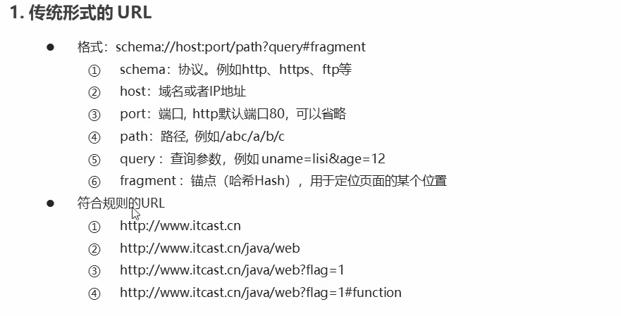
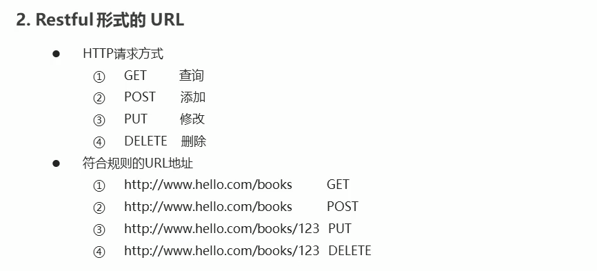

## 1，前后端交互模式
### 1.1，接口调用的方式
   * 原生的ajax
   * 基于jQuery的ajax
   * fetch
   * axios
  
### 1.2，URL地址格式
   1. 传统格式的URL
    
   2. Restful形式的URL
     
## 2，Promise用法
Promise 是异步编程的一种解决方案，其实是一个构造函数  
Promise 对象提供了简洁的API，使得控制异步操作更容易,解决回调地狱问题   

### 2.3 Promise基本用法
   1. 实例化Promise 对象，够着函数中传递函数，该函数用于处理异步任务
   2. resolve 和 reject 两个参数用来处理成功和失败两种情况，并通过`p.then`获取处理结果
```
var p = new Promise(function(resolve,reject){
	//成功时调用 resolve();
	//失败时调用 reject();
})
p.then(function(ret){
	//从resolve()得到结果
},function(ret){
	//从reject()得到结果
})
```

### 2.4 基于Promise 处理Ajax请求
1. 处理原生Ajax
```
function queryData (url){
		   var p =  new Promise(function(resolve,reject){
			   var xhr = new XMLHttpRequest();
			   xhr.onreadystatechange = function(){
				   if(xhr.readyState != 4) return;
				   if(xhr.readyState == 4 & xhr.status == 200){
					   //处理正常情况
					   resolve(xhr.responseText)
				   }else{
					   //处理异常
					   reject('服务器异常')
				   }
			   };
			   xhr.open('get',url);
			   xhr.send('abc');
		   });
		   return p
	    };
		queryData('http://localhost:3000/data')  
		
		//
		 .then(function(data){
			 console.log(data)
		 },function(info){
			 console.log(info)
		 })
```		 

2. 发送多个Ajax请求
```
queryData()
 .then(function(data){
	 return queryData();
 })
 .then(function(data){
	 return queryData();
 })
 .then(function(data){
	 return queryData();
 })
```

### 2.5 then参数中的函数返回值
 1. 返回Promise实例对象
      * 返回的该实例对象会调用下一个then
 2. 返回普通值
      * 返回的普通值会直接传递给下个then，通过then参数中的函数的参数接收该值

### 2.6 Promise常用API
 1. 实例方法
   * p.then()     得到异步任务的正确结果，也可以添加第二个回调函数获取异常结果
   * p.catch()    专门用来获取异常信息
   * p.finally()  成功与否都会执行
 2. 对象方法
   Promise.all()  并发处理多个任务，所以任务执行完才能得到结果
   Promise.race() 并发处理多个任务，只要有一个任务完成就能得到结果
   ```
   Promise.all([p1,p2,p3]).then((result) => {consele.log(result}) 
   Promise.race([p1,p2,p3]).then((result) => {consele.log(result}) 
   ```
   


## 3，接口调用-fetch用法

### 3.1 fetch概述
   1. 基本特性
	  * 更加简单的数据获取方式，功能更强大，更灵活，可以看着是xhr的升级版
	  * 基于Peomise实现
   2. 语法结构
      ```
	  fetch(url).then(fn2)   //获取正确的数据
	            .then(fn3)
				...
				.catch(fn)   //获取异常
	 		
### 3.2 基本用法
      ```
	  fetch(url).then(data=>{
		  return data.text();
	  }).then(data=>{
		  //注意，这里得到才是最终的数据
		  console.log(data);
	  })
	  ```
### 3.3 fetch请求参数
   1. 常用配置选项
     * method(String):   --http请求方法，默认为GET (GET,POST,PUT,DELETE)   
	 *  body(String):    --http的请求参数
	 *  headers(Object):  --http的请求头，默认为{}
     ```
     fetch('/abc',{
     	method: 'get'
     }).then(data=>{
     		  return data.text();
     }).then(data=>{
     		  //注意，这里得到才是最终的数据
     		  console.log(data);
     })
     ```
	 
   2. GET请求方式的参数传递

     传统格式的URL
     ```
	 fetch('/abc?id=123',{
	 	method: 'get'
	 }).then(data=>{
	 		  return data.text();
	 }).then(data=>{
	 		  //注意，这里得到才是最终的数据
	 		  console.log(data);
	 })
	 ```
     
	 Restful形式的URL
     ```
	 fetch('/abc/123',{
	 	method: 'get'
	 }).then(data=>{
	 		  return data.text();
	 }).then(data=>{
	 		  //注意，这里得到才是最终的数据
	 		  console.log(data);
	 })
	 ```
   
   3. DELETE请求方式的参数传递

     ```
	 fetch('/abc/123',{
	 	method: 'delete'
	 }).then(data=>{
	 		  return data.text();
	 }).then(data=>{
	 		  //注意，这里得到才是最终的数据
	 		  console.log(data);
	 })
	 ```

   4. POST请求方式的参数传递(增)
   
   传统数据格式
     ```
	fetch('http://localhost:3000/books',{
		method: 'post',
		body: 'uname=张三&pwd=124',
		headers: {
				'Content-Type': 'application/x-www-form-urlencoded'
			}
	}).then(data=>{
			  return data.text();
	}).then(data=>{
			  //注意，这里得到才是最终的数据
			  console.log(data);
	})
	 ```
	 
	 post请求 --json格式
	 ```
	 fetch('http://localhost:3000/books',{
	 	method: 'post',
	 	body: JSON.stringify({
	 		uname: '李四',
	 		pwd: '456789'
	 	}),
	 	headers: {
	 			'Content-Type': 'application/json'
	 		}
	 }).then(data=>{
	 		  return data.text();
	 }).then(data=>{
	 		  //注意，这里得到才是最终的数据
	 		  console.log(data);
	 })
	 
	 ```
	 

   5. PUT请求方式的参数传递(改)
     ```
	 etch('http://localhost:3000/books/123',{
	 	method: 'put',
	 	body: JSON.stringify({
	 		uname: '李四',
	 		pwd: '456'
	 	}),
	 	headers: {
	 			'Content-Type': 'application/json'
	 		}
	 }).then(data=>{
	 		  return data.text();
	 }).then(data=>{
	 		  //注意，这里得到才是最终的数据
	 		  console.log(data);
	 })
	 ```
	 
### 3.4 fetch 响应结果
   1. 响应数据格式
     * text()   --将返回体处理成字符串格式
	 * json()   --返回结果和JSON.parse(responseText)一样
	 
	 实例
     ```
	 fetch('http://localhost:3000/json')
	  .then(data=>{
	 	 //json方法，返回 JavaScript 对象
	 	 //return data.json();
	 	 
	 	 //text()方法，返回字符串格式
	 	 return data.text();
	  })
	  .then(data=>{
	 	 //json输出测试
	 	 // console.log(data);
	 	 // console.log(data.uname);
	 	 // console.log(typeof data);
	 	 
	 	 //text()输出测试
	 	 console.log(typeof data);
	 	 var obj = JSON.parse(data);  //转换成JavaScript 对象
	 	 console.log(obj.uname,obj.age, obj.gender)
	  })
	  ```
	 
## 4，接口调用-axios用法

### 4.1 axios基本特性
axios(官网:https://github.com/axios/axios) 是一个基于Promise用于浏览器与node.js的HTTP客户端

#### 它具有以下特征
 * 支持浏览器和node.js
 * 支持Promise
 * 能拦截请求和响应
 * 能自动转换JSON数据

### 4.2 axios基本用法
```
axios.get('url').then(ret=>{
	//data属性名称是固定的，用于获取后台响应的数据
	console.log(ret.data);
})
```
### 4.3 axios常用的API
* get   --查询数据
* post  --添加数据
* put   --修改数据
* delete  --删除数据


### 4.4 axios参数传递
1. GET参数传递
   * 通过URL传递参数
   * 通过params传递参数

传统URL传参
```
axios.get('/axios?id=123')
    .then(ret =>{
		console.log(ret.data)
	})
```

```
axios.get('/axios/123')
    .then(ret =>{
		console.log(ret.data)
	})
```	

params对象传参方式
```
axios.get('http://localhost:3000/axios',{
	params: {
		id: 789
	}
})
   .then(ret=>{
	  console.log(ret.data);
   })			   
```	
		   
2. DELETE参数传递
   * 传递方式与GET类似
   

传统URL传参
```
axios.delete('/axios?id=123')
    .then(ret =>{
		console.log(ret.data)
	})
```

```
axios.delete('/axios/123')
    .then(ret =>{
		console.log(ret.data)
	})
```	

params对象传参方式
```
axios.delete('http://localhost:3000/axios',{
	params: {
		id: 789
	}
})
   .then(ret=>{
	  console.log(ret.data);
   })			   
```	

3. POST传递参数
   * 通过选项传递参数(默认传递的是json格式)
```
axios.post('http://localhost:3000/axios',{
	uname: "Tom",
	pwd: 789
})
   .then(ret=>{
	  console.log(ret.data);
   })
```

  * 通过URLSearchParams传递参数(application/x-www-form-erlencoded)
```
const params = new URLSearchParams();
params.append('uname','张三')	
params.append('pwd','123456')
axios.post('http://localhost:3000/axios',params)
   .then(ret=>{
	  console.log(ret.data);
   })
```

4. PUT参数传递
   * 参数传递方式与pust类似
```
axios.post('http://localhost:3000/axios/id',{
	uname: "Tom",
	pwd: 789
})
   .then(ret=>{
	  console.log(ret.data);
   })
```

### 4.5 axios的响应结果
响应结果的主要属性
 * data: 实际响应回来的数据
 * headers: 响应头信息
 * status: 响应状态码
 * statusText: 响应状态信息
```
axios.get('http://localhost:3000/axios-json').then(ret=>{
	 console.log(ret.data.pwd);
   })
```			   

### 4.6 axios的全局配置
* axios.defaults.timeout=3000;  //设置超时时间
* axios.defaults.baseURL='http://localhost:3000/app'   //设置默认地址
* axios.defaults.headers['mytoken']= 'aqwerwqerqwrewrqeq1234df23'  //设置请求头

### axios 请求拦截器
1. 请求拦截器   
  再请求发出之前设置一些信息
 ```
  axios.interceptors.request.use(function(config){
  	//在请求发出之前进行一些信息设置
  	return config;
  },function(err){
  	//处理响应的错误信息
  })
 ```
2. 响应拦截器
  在获取数据之前对数据做一些加工处理
 ```
  axios.interceptors.response.use(function(res{
  	//在这里对返回的数据进行处理
  	return res;
  },function(err){
  	//处理响应的错误信息
  })
 ``` 
  

## 5，接口调用-async/await用法

### 5.1 async/await的基本用法
 * async/await是ES7引入的新语法，可以更加方便的进行异步操作
 * async关键字用于函数上(async函数的返回值是Promise实例对象)
 * await关键字用于saync函数中(await可以得到异步的结果,await后面可以跟Promise实例对象)
 ```
 async function queryData(id){
	 const ret = await axios.get('/data')
	 return ret;
 }
 queryData.then(ret=>{
	 console.log(ret)
 })
 ```
 
### 5.2 async/await处理多个异步请求
多个异步请求场景（await 自动保持执行顺序）
```
async function queryData() {
   var info = await axios.get('async1');   
   var ret = await axios.get('async2?info=' + info.data); 
   return ret.data;
}
queryData().then(data=>{
   console.log(data)
  });
```


 
## 6，基于接口的案例