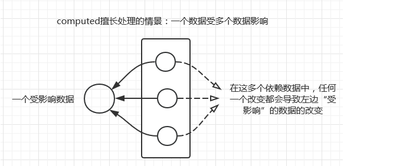
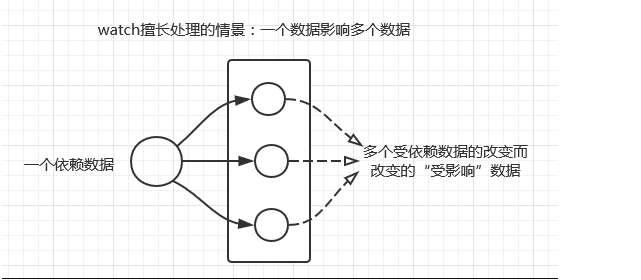

## some()方法
some为数组中的每一个元素执行一次fn函数，直到找到一个使得fn返回 true 。如果找到了这样一个值，some将立即返回 ture ，其余的就不在运行，
#### 语法：
	 array.some(function(item,index,array）{})　　
	 // item:当前元素的值；
	 // index:当前元素的索引；
	 // array:当前元素的数组对象；
#### 例子
```
// 数组中存在值都大于35
var ages = [32, 33, 12, 40];
var age =  ages.every((val,ind)=>{
   return val>35; 
})
console.log(age)// true
```


## findIndex()方法
findIndex() 方法返回传入一个测试条件（函数）符合条件的数组第一个元素位置。

#### 语法:
array.findIndex(function(currentValue, index, arr), thisValue)

#### 参数	
* currentValue	必需。当前元素
* index	可选。当前元素的索引
* arr	可选。当前元素所属的数组对象
* thisValue	可选。 传递给函数的值一般用 "this" 值。如果这个参数为空， "undefined" 会传递给 "this" 值


## vue中methods、watch、computed之间的差别对比以及适用场景
### 1.computed适用场景：

```
// ...
    computed: {
        fullName: {
            // getter
            get: function () {
                return this.firstName + ' ' + this.lastName
            },
            // setter
            set: function (newValue) {
                var names = newValue.split(' ')
                this.firstName = names[0]
                this.lastName = names[names.length - 1]
            }
        }
    }
```
### 2.watch适用场景：

```
var vm = new Vue({
        el: '#app',
        data: {
            firstName: 'Foo',
            lastName: 'Bar',
            fullName: 'Foo Bar'
        },
        watch: {
            firstName: function (val) {
                this.fullName = val + ' ' + this.lastName
            },
            lastName: function (val) {
                this.fullName = this.firstName + ' ' + val
            }
        }
    })
```
### 3.methods适用场景
通常在methods这里面写入方法，只要调用就会重新执行一次，方法的引用需要()
#### 总结：
在computed和watch方面，一个是计算，一个是观察，
computed 计算里面的内容变化就触发，
warch  观察的属性变化就触发

## ForEach()方法
forEach() 方法用于调用数组的每个元素，并将元素传递给回调函数。
#### 语法:
array.forEach(function(currentValue, index, arr), thisValue)
#### 参数
currentValue	必需。当前元素
index	可选。当前元素的索引值。
arr	可选。当前元素所属的数组对象。
thisValue	可选。传递给函数的值一般用 "this" 值。如果这个参数为空， "undefined" 会传递给 "this" 值

## vue中输入框事件的使用——@input、@keyup.enter、@change、@blur
### 一、@input（或者是v-on:input）
适用于实时查询，每输入一个字符都会触发该事件
### 二、@keyup.enter
该事件与v-on:input事件的区别在于：input事件是实时监控的，每次输入都会调用，而@keyup.enter事件则是在pc上需要点击回车键触发，而在手机上则是需要点击输入键盘上的确定键才可触发。
### 三、@change
该事件和enter事件相似，在手机上都是要经过触发虚拟键盘的搜索键才会触发事件。使用方式同input事件。
### 四、@blur（失焦）
要满足输入框在输入完成、移到其他地方时进行验证时，需要用到该事件，用此事件进行绑定验证方法即可。
注：如果使用mintui中的mt-field标签时，对应的blur（失焦）事件要执行时，要用@blur.native.capture=""来代替@blur。