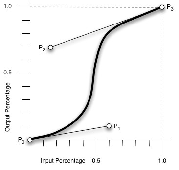

## 缩放，移动，旋转（旋转照片墙）
### CSS3 transform 属性


|值						|描述											|
|--						|--												|
|rotate(angle)			|定义 2D 旋转，在参数中规定角度。				|
|rotate3d(x,y,z,angle)	|定义 3D 旋转。想象是原点到(x,y,z)的点为轴的旋转|
|rotateX(angle)			|定义沿着 X 轴的 3D 旋转。						|
|scale(x[,y]?)			|定义 2D 缩放转换。沿着X轴或Y轴放大或缩小，缩放值为()中的x与y值，()中只有一个值时表示xy值一样|
|scale3d(x,y,z)			|定义 3D 缩放转换。								|
|scaleX(x)				|通过设置 X 轴的值来定义缩放转换。				|
|skew(x-angle,y-angle)	|定义沿着 X 和 Y 轴的 2D 倾斜转换。				|
|skewX(angle)			|定义沿着 X 轴的 2D 倾斜转换。					|
|translate(xpx,ypx)		|向xy单位方向移动。另只填一个px值表示沿X轴移动				|
|translate3d(x,y,z)		|向xyz单位方向移动。								|
|translateX(x)			|只是用 X 轴的值。向x单位方向移动。					|
|						|												|

注：width宽是X轴，height高是Y轴，垂直于屏幕是Z轴。

### CSS3 transition 属性
transition 属性是一个简写属性，用于设置四个过渡属性： 
 
注意：不要用在:hover{}内，不然结束效果可能控制不了

1. transition-property	
     * `transition-property: none|all|property;`
     *  all  --所有属性都将获得过渡效果。默认值
	 *  property  --定义应用过渡效果的 CSS 属性名称列表，列表以逗号分隔。(一般是width，height)
2. transition-duration	规定完成过渡效果需要多少秒或毫秒。
3. transition-timing-function 属性
	* linear 规定以相同速度开始至结束的过渡效果（等于 cubic-bezier(0,0,1,1)）。
	* ease 规定慢速开始，然后变快，然后慢速结束的过渡效果（cubic-bezier(0.25,0.1,0.25,1)）。
	* ease-in 规定以慢速开始的过渡效果（等于 cubic-bezier(0.42,0,1,1)）。
	* ease-out 规定以慢速结束的过渡效果（等于 cubic-bezier(0,0,0.58,1)）。
	* ease-in-out 规定以慢速开始和结束的过渡效果（等于 cubic-bezier(0.42,0,0.58,1)）。
	* cubic-bezier(n,n,n,n) 在 cubic-bezier 函数中定义自己的值。可能的值是 0 至 1 之间的数值。

**说明**    



cubic-bezier称为三次贝塞尔曲线，主要是生成速度曲线的函数，cubic-bezier(n,n,n,n)中的四个参数为(x1,y1,x2,y2)

注：X轴的范围是0~1，超出cubic-bezier将失效，Y轴的取值没有规定，但是也不宜过大。

其中p0(0,0)，p3(1,1)是固定点，p1(x1,y1)，p2(x2,y2)是操作点；

依次连接p0p1p2p3，假设p0p1上有一动点A，p1p2上有一动点B，p2p3上有一动点C，有p0A/p0p1=p1B/p1p2=p2C/p2p3=t

4. transition-delay	定义过渡效果何时开始。即在过渡效果开始前等待多少秒


## 利用@media screen实现网页布局的自适应（响应式布局）
### 准备工作1：设置Meta标签
首先我们在使用Media的时候需要先设置下面这段代码，来兼容移动设备的展示效果：

`<meta name="viewport" content="width=device-width, initial-scale=1.0, maximum-scale=1.0, user-scalable=no">`

这段代码的几个参数解释：

width = device-width：宽度等于当前设备的宽度

height = device-height：高度等于当前设备的高度

initial-scale：初始的缩放比例（默认设置为1.0）  

minimum-scale：允许用户缩放到的最小比例（默认设置为1.0）    

maximum-scale：允许用户缩放到的最大比例（默认设置为1.0）   

user-scalable：用户是否可以手动缩放（默认设置为no，因为我们不希望用户放大缩小页面） 

### 准备工作2：加载兼容文件JS
因为IE8既不支持HTML5也不支持CSS3 Media，所以我们需要加载两个JS文件，来保证我们的代码实现兼容效果：

<!--[if lt IE 9]>
  <script src="https://oss.maxcdn.com/libs/html5shiv/3.7.0/html5shiv.js"></script>
  <script src="https://oss.maxcdn.com/libs/respond.js/1.3.0/respond.min.js"></script>
<![endif]-->

### @Media用法
```
@media screen and (min-width:960px) and (max-width:1200px){
    body{
        background:yellow;
    }
}
```

## CSS3 弹性盒子(Flex Box)
### CSS3 弹性盒子内容

弹性盒子由弹性容器(Flex container)和弹性`子元素`(Flex item)组成。（一旦父级设置了display:flex; 它的子元素就是弹性子元素）

弹性容器通过设置 display 属性的值为 flex 或 inline-flex将其定义为弹性容器。

弹性容器内包含了一个或多个弹性子元素。

**例子**
```
<!DOCTYPE html>
<html>
<head>
<style>
.flex-container {
    display: -webkit-flex;
    display: flex;
    width: 400px;
    height: 250px;
    background-color: lightgrey;
}

.flex-item{
    background-color: cornflowerblue;
    width: 100px;
    height: 100px;
   margin: 10px;
}
</style>
</head>
<body>

<div class="flex-container">
  <div class="flex-item">flex item 1</div>
  <div class="flex-item">flex item 2</div>
  <div class="flex-item">flex item 3</div>
</div>

</body>
</html>
```

### 弹性盒子常用属性
#### 一、flex-direction属性决定主轴的方向：
flex-direction属性决定主轴的方向：。

语法
`flex-direction: row | row-reverse | column | column-reverse`

flex-direction的值有:
   * row：横向从左到右排列（左对齐），默认的排列方式。
   * row-reverse：反转横向排列（右对齐，从后往前排，最后一项排在最前面。
   * column：纵向排列。
   * column-reverse：反转纵向排列，从后往前排，最后一项排在最上面。

#### 交叉轴
交叉轴是垂直方向还是水平方向，需要根据主轴方向（flex-direction: row），如果主轴是水平方向那么交叉轴为垂直方向，如果主轴方向垂直方向（flex-direction: column），交叉轴就是水平方向。


#### 二、flex-wrap（一条轴线排不下如何换行）：
`.box {flex-direction: row | row-reverse | column | column-reverse;}`

1、Nowarp：不换行，在一行显示

2、warp：内容超过后换行，第一行在上方

3、warp-reverse：换行后有两条轴线，reverse就是把轴线排列的顺序倒过来，第一行在下方。

注：容器的flex-wrap属性值为wrap或者wrap-reverse的容器是多行容器。

#### 三、justify-content定义项目在主轴上的对齐方式：
`.box {justify-content: flex-start | flex-end | center | space-between | space-around;}`

1、flex-start：（默认值），左对齐

2、flex-end：右对齐

3、center：居中

4、space-between：两端对齐，项目之间的间隔都相等。

5、space-around：项目位于各行之前、之间、之后都留有空白的容器内。

#### 四、align-items(交叉轴对齐方式)：
1、align-items:stretch;

2、align-items:flex-start（start侧开始，上对齐）

3、align-items:flex-end（end侧开始，下对齐）

4、align-content :center (中心对齐)

5、align-items:baseline（基线对齐）

#### 五 align-content(交叉轴对齐方式)：
1、align-content :stretch (拉伸)

2、align-content :flex-start (start侧开始，上对齐)

3、align-content :flex-end（end侧开始，下对齐）

4、align-content :center (中心对齐)

5、align-content:space-between（上下没有间距，中间各子元素间距相同）

6、align-content:space-around (上下间距之和等于中间各个间距)

区别：align-content:center对单行是没有效果的,而align-items:center不管是对单行还是多行都有效果

#### CSS align-self 属性
align-self 属性定义flex子项单独在侧轴（纵轴）方向上的对齐方式。


#### CSS flex 属性
flex 属性用于设置或检索弹性盒模型对象的子元素如何分配空间。

flex 属性是 flex-grow、flex-shrink 和 flex-basis 属性的简写属性。

* flex-grow	一个数字，规定项目将相对于其他灵活的项目进行扩展的量。   
* flex-shrink	一个数字，规定项目将相对于其他灵活的项目进行收缩的量。    
* flex-basis	项目的长度。合法值："auto"、"inherit" 或一个后跟 "%"、"px"、"em" 或任何其他长度单位的数字。    
```
<!DOCTYPE html>
<html>
<head>
<meta charset="utf-8">
<title>W3Cschool教程(w3cschool.cn)</title>
<style>
#main {
    width: 350px;
    height: 100px;
    border: 1px solid #c3c3c3;
    display: -webkit-flex; /* Safari */
    display: flex;
}

#main div {
    -webkit-flex-grow: 1; /* Safari 6.1+ */
    -webkit-flex-shrink: 1; /* Safari 6.1+ */
    -webkit-flex-basis: 100px; /* Safari 6.1+ */
    flex-grow: 1;
    flex-shrink: 1;
    flex-basis: 100px;
}

#main div:nth-of-type(2) {
    -webkit-flex-shrink: 3; /* Safari 6.1+ */
    flex-shrink: 3;
}
</style>
</head>
<body>
```


## px、em、rem、%、vw、vh、vm这些单位的区别

### px
px就是pixel的缩写，意为像素。px就是设备或者图片最小的一个点，比如常常听到的电脑像素是1024x768的，表示的是水平方向是1024个像素点，垂直方向是768个像素点。

### em
参考物是父元素的font-size，具有继承的特点。如果自身定义了font-size按自身来计算（浏览器默认字体是16px），整个页面内1em不是一个固定的值。
特点是1. em的值并不是固定的； 2. em会继承父级元素的字体大小。

### rem
rem是相对于根元素html的font-size，这样就意味着，我们只需要在根元素确定一个参考值，可以设计HTML为大小为10px，到时设置1.2rem就是12px.以此类推。

`html{font-size:14px}`   --设置1rem = 14px

### %
1. 对于普通定位元素就是我们理解的父元素 
2. 对于position: absolute;的元素是相对于已定位的父元素 
3. 对于position: fixed;的元素是相对于ViewPort（可视窗口），

### vw
css3新单位，view width的简写，是指可视窗口的宽度。假如宽度是1200px的话。那10vw就是120px

举个例子：浏览器宽度1200px, 1 vw = 1200px/100 = 12 px。

### vh
css3新单位，view height的简写，是指可视窗口的高度。假如高度是1200px的话。那10vh就是120px

举个例子：浏览器高度900px, 1 vh = 900px/100 = 9 px。

### 其他
css还有哪些长度单位？


in:寸


cm:厘米


mm:毫米


t:point，大约1/72寸


pc:pica，大约6pt，1/6寸


6.更多问题
1.pc pt ch一般用在什么场景?
这些我们网页设计基本上用不到，在排版上会有用处。


2.如何使 1rem=10px
在设置HTML{font-size：62.5%；}即可


## CSS3 渐变
* 线性渐变（Linear Gradients）- 向下/向上/向左/向右/对角方向
* 径向渐变（Radial Gradients）- 由它们的中心定义

### CSS3 线性渐变
**语法**    
`background: linear-gradient(direction|angle, color-stop1, color-stop2, ...);`
  
从左上角到右下角的线性渐变：
```
#grad {
  background: -webkit-linear-gradient(left top, red , blue); /* Safari 5.1 - 6.0 */
  background: -o-linear-gradient(bottom right, red, blue); /* Opera 11.1 - 12.0 */
  background: -moz-linear-gradient(bottom right, red, blue); /* Firefox 3.6 - 15 */
  background: linear-gradient(to bottom right, red , blue); /* 标准的语法 */
} 
```

### CSS3 径向渐变
径向渐变由它的中心定义。
`background: radial-gradient(center, shape size, start-color, ..., last-color);          `